# Test Plan

## Unit Testing

Each unit test tests one individual aspect of a feature (e.g. valid/invalid input handling, permission checking) in isolation and is directly mapped to a test method in the corresponding feature's `test.py` file.

| Unit Test ID | Feature | Test Method | Description | Expected Result |
|-|-|-|-|-|
| UT1 | F1 | test_create_project_with_valid_fields | Create a project with valid data | Project is saved successfully in the database |
| UT2 | F1 | test_create_project_with_blank_description | Create a project with optional fields blank (empty description field) | Project is created without errors |
| UT3 | F1 | test_create_project_loads | Access create project page as an authorised user | Page loads succesfully (HTTP 200 OK) |
| UT4 | F1 | test_valid_post_request_creates_project | Submit valid project creation form | Page is created and user is directed |
| UT5 | F1 | test_invalid_post_request_creates_project | Submit invalid project creation form (empty name field) | Project is not created and form is re-rendered |
| UT6 | F1 | test_unauthorised_user_denied_from_project | Unauthorised user attempts access | User is denied access (HTTP 403 Forbidden) |
| UT7 | F2 | test_create_task | Create a task linked to a project | Task is saved and linked correctly |
| UT8 | F2 | test_project_specifics_loads | Access project details page | Page loads succesfully (HTTP 200 OK) |
| UT9 | F2 | test_add_valid_task | Submit valid task | Task is created and linked to correct project (HTTP 200 OK) |
| UT10 | F2 | test_add_invalid_task | Submit invalid task (empty description field) (HTTP 200 OK) | Task is not created and page stays the same |
| UT11 | F8 |  test_create_submission_success | Create a submission with valid data | Submission is successfully created |
| UT12 | F8 |  test_create_submission_missing_title | A submission without a title is rejected and nothing is saved. | No submission created and promt to add the title | 
| UT13 | F8 |  test_create_submission_missing_description | A submission without a description is rejected nothing is saved. | No submissio is created | 
| UT14 | F8 |  test_create_submission_invalid_category | A submission with an invalid category is rejected nothing is saved. | No Submission created | 
| UT15 | F3 | test_add_user_to_project | Add a user to a project | User is added succesfully to the project (HTTP 200 OK) |
| UT16 | F3 | test_add_users_to_project | Add multiple users to a project | All users are added succesfully to the project (HTTP 200 OK) |
| UT18 | F7 | test_filter_dashboard_by_name | Existing project is searched for via the filter dashboard on the homepage via its name. | The project must be in `projects_list` and `no_projects_found` must be true. |
| UT19 | F7 | test_filter_dashboard_no_results | Non-existant project is searched for via the filter dashboard on the homepage. | `projects_list` must be empty and `no_projects_found` must be false. |
| UT20 | F12 | test_high_contrast_button_in_template | Homepage is opened. | The high-contrast mode toggle must be in the template. |
| UT21 | F6 | test_interactive_map_in_template | Homepage is opened. | The leaflet map must be in the template. |
| UT22 | F13 | test_user_logins_with_valid_credentials | Project Manager logs in with correct credentials | Project Manager is redirected to their projects dashboard page |
| UT23 | F13| test_user_logins_with_invalid_credentials | User submits login form with wrong credentials | Login page reloads with error message "Invalid username or password" |
| UT24 | F13 | test_user_logout | Logged in user presses the logout button in navbar | user is logged out and redirected to the home page, the web-app is reloaded to only show pages which do not require authentication |
| UT25 | F14 | test_other_cannot_delete_submission | User logs in as a project member tries to delete a submission through a POST request | Submissions remains unchanged |

## Integration Testing

These integration tests verify that multiple features of the project can work together given a realistic scenario. Each integration test follows a defined flow and validates the interactions between the different Django components (e.g. views, forms, models).

| Integration Test ID | Feature | Scenario |Test Method | Given Inputs | Expected Outputs | Actual Outputs | Evidence |
|-|-|-|-|-|-|-|-|
| IT1 | F1 | Login -> Create Project | test_authorised_user_can_create_project | Logged in as authorised admin user. Name = “Community Garden Project” Description = “Create a shared garden space for residents” Location = “Selly Oak” Category = “Other” | Project should be created successfully. HTTP response should complete successfully after redirect. Project should be saved in the database with the logged-in admin as manager. | Test passed. Response returned status code 200 after redirect. One `Project` object was created. The saved project name matched the input and the manager was the logged-in admin user. | 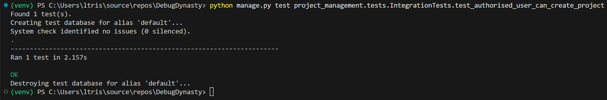 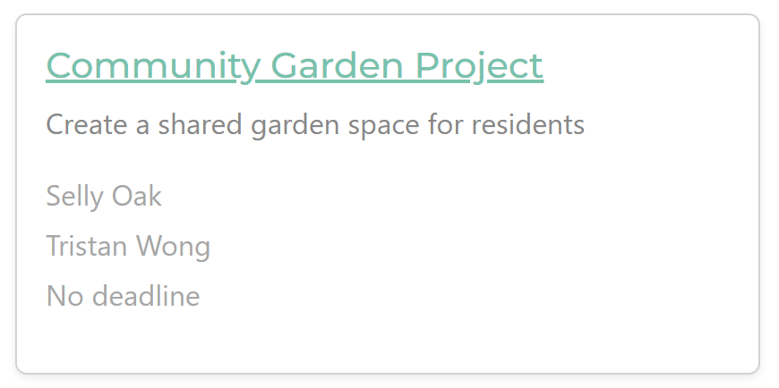 |
| IT2 | F1 | Login -> Create Project (Invalid Input) | test_invalid_submission_doesnt_create_project | Logged in as authorised admin user. Project form submitted with invalid input (name left blank). Name = "" Description = “Missing required name” Location = “Selly Oak” | Project should not be created. Form should be re-rendered with status code 200. Database should remain unchanged. | Test passed. Response returned status code 200. No `Project` object was created. |  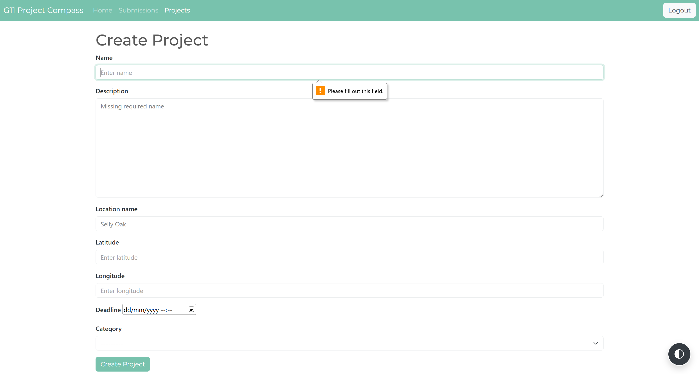 |
| IT3 | F1, F2 | Login -> Create Project -> Add Task | test_create_project_then_add_task | Logged in as authorised admin user. First submit project form with: Name = “Road Safety Improvements” Description = “Improve crossing safety near the school”  Location = "Manchester" Category = “Other”. Then submit task form on that project with: Description = “Install warning signs”. | Project should be created successfully. Task should then be created successfully and linked to the newly created project. Response after task submission should complete successfully. | Test passed. One `Project` object and one `Task` object were created. Response after task submission returned status code 200. The saved task was linked to the correct project and the description matched the input. | 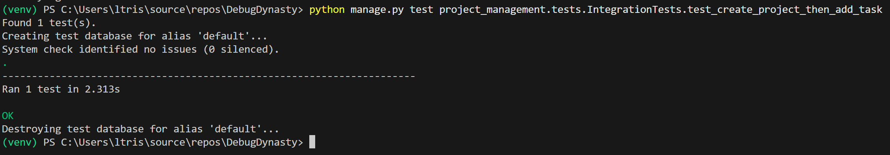 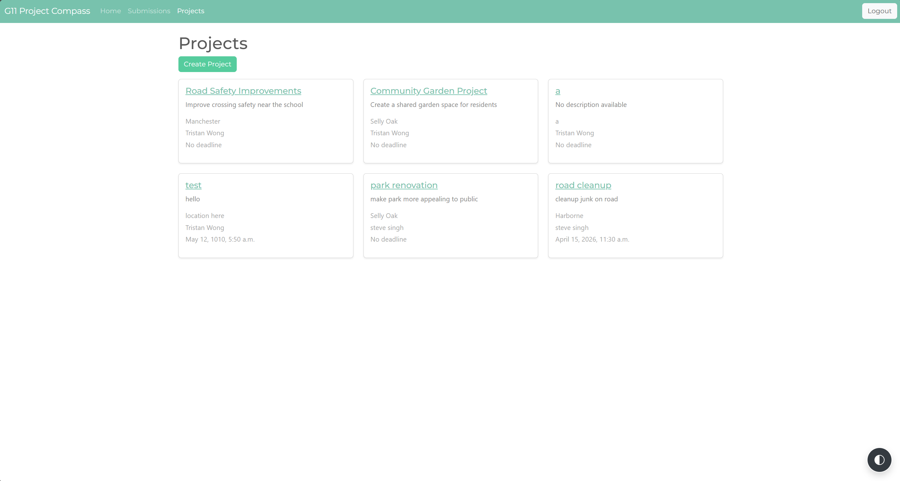 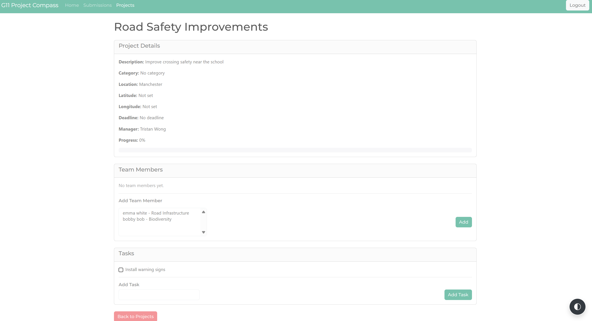 |
|IT4 | F2 | Login -> View Project Specifics -> Complete Task -> View Project Specifics | test_project_specifics_displays_completed_task | Logged in as authorised admin user. Existing project: “Park Renovation”. Existing task added to that project: “Replace broken benches”. Task is marked as completed. User requests the project specifics page. | Project specifics page should load successfully and display the task marked as completed. | Test passed. Response returned status code 200. | 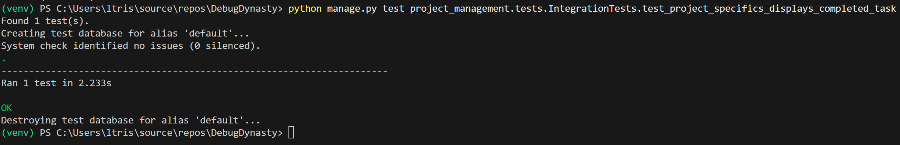 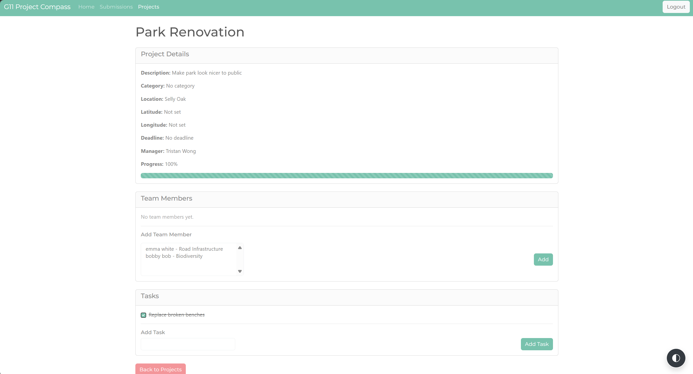 |
| IT5 | F2 | Login -> View Project Specifics -> Add Task (Invalid Input) | test_invalid_task_submission_does_not_create_task | Logged in as authorised admin user. Existing project: “Air Quality Monitoring”. Task form submitted with invalid input (description left blank) | Task should not be created. Page should re-render successfully. The project should still contain zero tasks. | Test passed. Response returned status code 200. No `Task` objects were created for the project. | 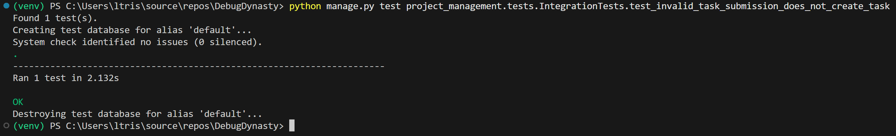 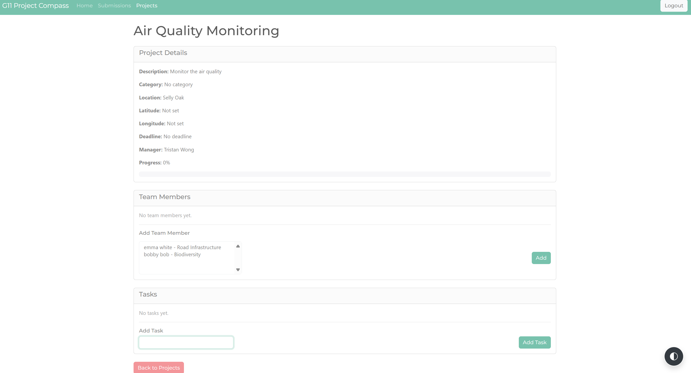 |
| IT6 | F8 | Submissions -> Create submission -> Enter relevant details (title, description, location, category) | test_create_submission_success | Anonymous user (not logged in) inserts (title = "Pothole on Heely Road", description = "Large pothole causing hazards.", location =  "1 Heely Street", category =  "infrastructure") | A valid entry on the submission list page with (title = "Pothole on Heely Road", description = "Large pothole causing hazards.", location =  "1 Heely Street", category =  "infrastructure") | valid entry is created on t he submission list |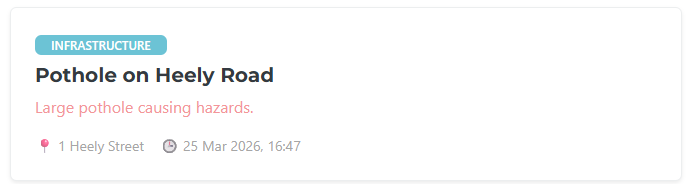 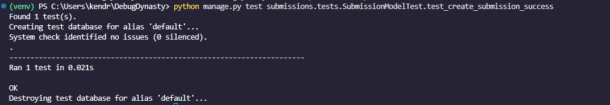|
| IT7 | F8 | Submissions -> Create submission -> Enter relevant details (title, description, location, category) | test_create_submission_missing_title | User attempts to creates a submissions  (title = "", description = "Missing title test.", location =  "2 Heely Street", category =  "safety") | A warning box alerting the user that a title is required for actual storage | No submission displayed in the list and a warning message is displayed | 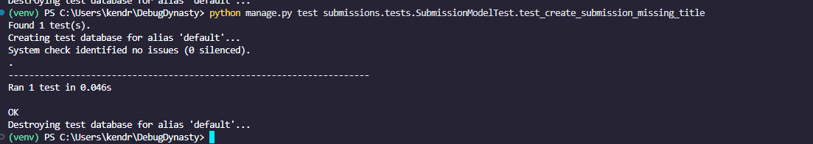 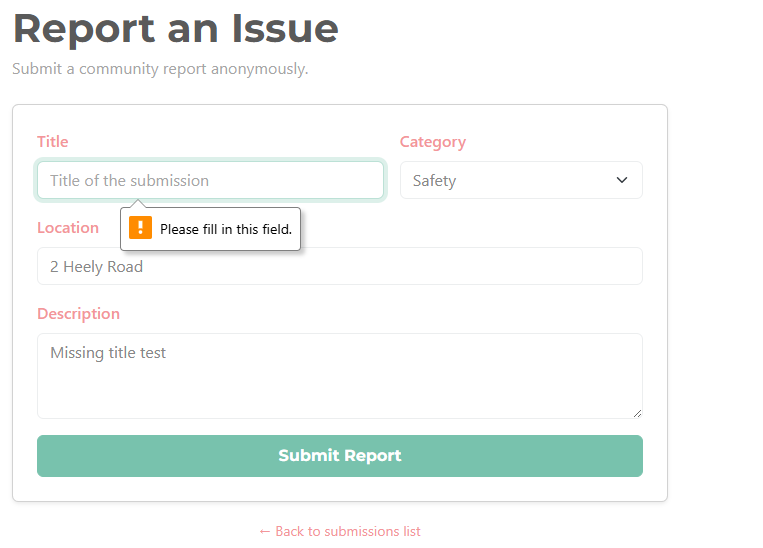 |
| IT8 | F8 | Submissions -> Create submission -> Enter relevant details (title, description, location, category) | test_create_submission_missing_description | Anonymous user (not logged in) inserts (title = "Valid Title", description = "", location =  "3 Heely Street", category =  "safety") | A warning box alerting the user that a description is required for actual storage | No submission displayed in the list and a warning message is displayed | 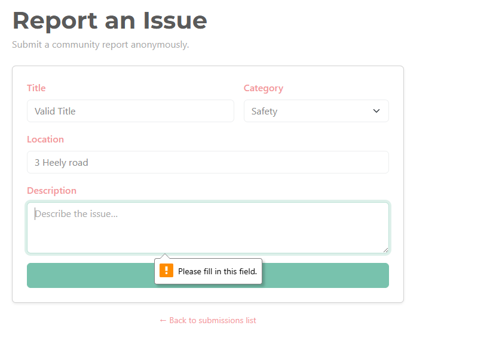 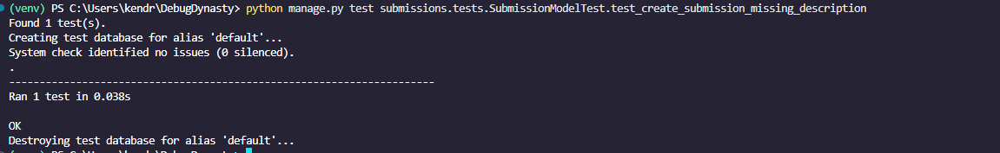 |
| IT9 | F8 | Submissions -> Create submission -> Enter relevant details (title, description, location, category) | test_create_submission_invalid_category | Anonymous user (not logged in) inserts (title = "Valid Title", description = "Category is not valid", location =  "4 Bad Category lane", category =  "aizensosuke") | Prevent users from selecting invalid categories | No submission displayed in the list | 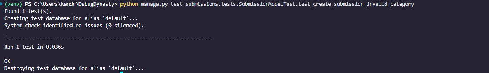 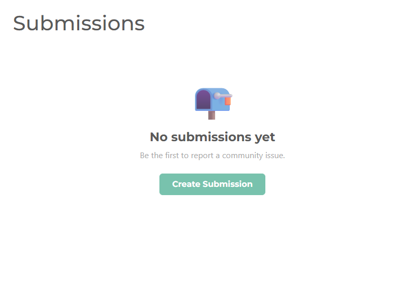 |
| IT10 | F1, F3 | Login -> Create Project -> View Project Specifics -> Add User -> View Project Specifics | test_add_user_then_view_project | Logged in as authorised admin user. First submit project with: Name = "Graffiti Removal" Description = "Remove graffiti" Location = "Selly Oak" Category = "Other". Then open the project specifics page to view the created project. Then submit a team member form, adding the user. |  Project should be created succesfully. Project specifics page should load correctly before and after the team member assignment. The selected user should be added to the correct project. The updated project specifics page should display the assigned team member. | Test passed. One `Project` object was created. The project specifics page returned status code 200 before and after team member assignment. The selected user was added to the project's `team_members` field and was displayed on the project specifics page. | 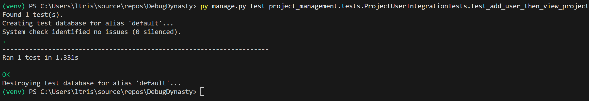 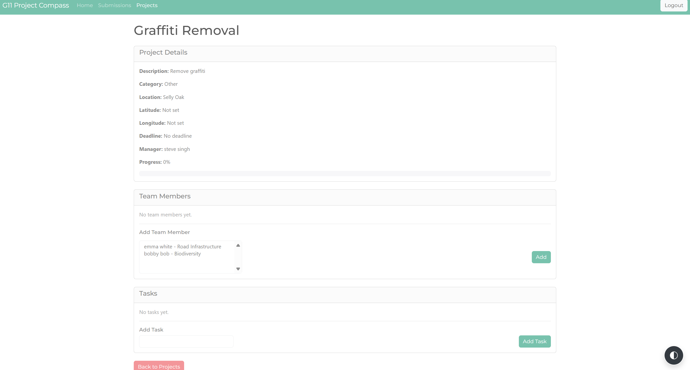 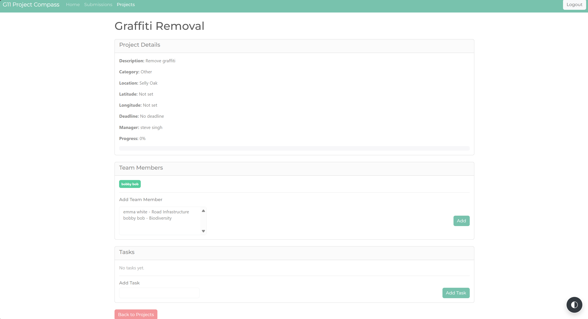 |
| IT11 | F1, F12 | Toggle high-contrast mode -> Create Project | Press high-contrast mode button and create a project. | Logged in as authorised admin user. Clicks on high-contrast mode toggle then opens create project page.  | Colours of the create project form is now high-contrast. | Test passed. Colours of the create project form have changed | 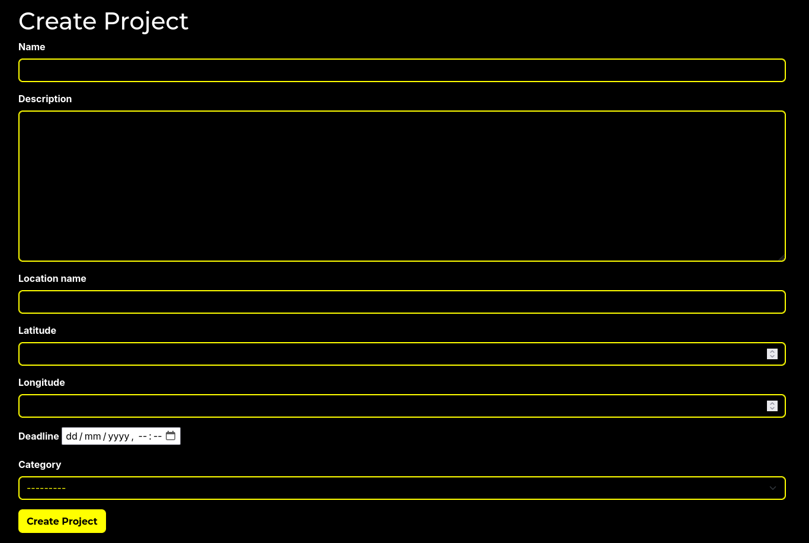 |
| IT12  | F6, F12 | Toggle high-contrast mode -> View filter dashboard | Press high-contrast mode and view the filter dashboard. | Anonymous user (not logged in) clicks on high-contrast mode toggle then views filter dashboard. | Colours of the filter dashboard is now high-contrast. | Test passed. Colours of the filter projects dashboard have changed appropriately. | 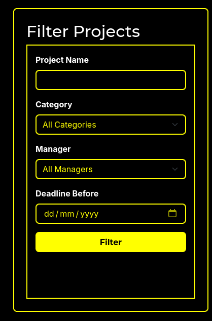 |
| IT13 | F8, F12 | Toggle high-contrast mode -> Open submissions. | Press high-contrast mode and view the submissions page. | Anonymous user (not logged in) clicks on high-contrast mode toggle then views. | Colours of the submissions list is now high-contrast. | Test  passed. Colours of the submissions list have changed appropriately. | 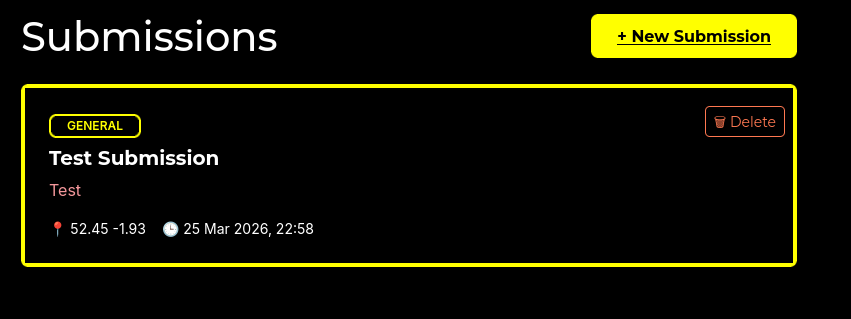 |
| IT14 | F6, F7  | Enter Valid Project Name -> Check Interactive Map for corresponding Pin. | Find a specific project on the interactive map through its name. | Anonymous user (not logged in) inserts (Name = "Test Project") then clicks on Filter button. | Map interface should show a pin named "Test Project". | Test passed. Pin is shown on the map with the correct name. | 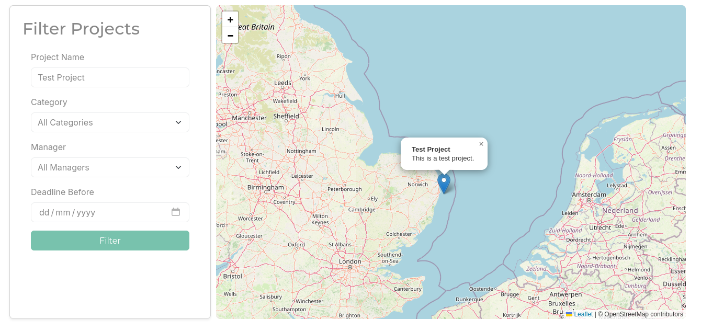 |
| IT15 | F13 | Login -> Admin Panel -> Create new user | test_admin_can_create_users | Logged in as admin user. Username="admin", password="password". Opens Admin Panel. Submits new project member form with details: "username":"testmember","first_name":"test","last_name":"member","email":"testmember@email.com","password":"Strongpassword123!","role":"URBAN_PLANNER","specialisation":"ROAD_INFRASTRUCTURE","date_joined_0": "2026-01-01","date_joined_1": "00:00:00","_save": "Save".  | The project member should be created successfully and saved to the database. | Test passed. Project Member created, response returned status code 302 | 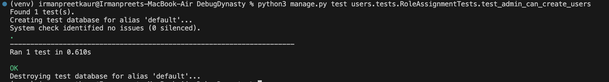 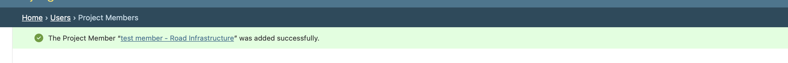 |
| IT16 | F14 | Login -> Admin Panel -> Change existing user | test_admin_can_change_role | Logged in as admin user. Username="admin", password="password". Opens Admin Panel. Submits change project member form with details: "username":"testmember","first_name":"test","last_name":"member","email":"testmember@email.com","password":"Strongpassword123!","role":"URBAN_PLANNER","specialisation":"ROAD_INFRASTRUCTURE","date_joined_0": "2026-01-01","date_joined_1": "00:00:00","_save": "Save".  | The project member's role should be updated successfully to "NGO_COORDINATOR" and saved to the database. | Test passed. Project Member role updated to "NGO_COORDINATOR", response returned status code 302 | 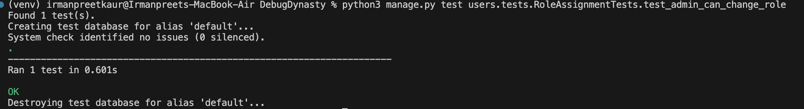 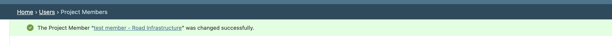 |
| IT17 | F13 | Login -> Submissions -> Delete Submission | test_project_manager_can_delete_submission | Logged in as project manager. Username="manager1", password="password123". Opens submissions page. Presses delete button, and confirms confirmation message  | The deleted submission should be deleted from the database and submission page should update to reflect the change. | Test passed. Submission successfully deleted from database, page reloaded and doesn't show the deleted submission. HTTP response returned status code 200 | 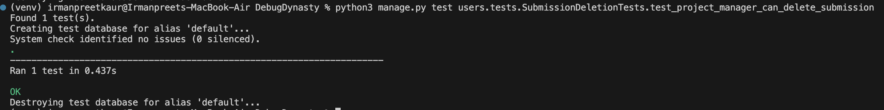 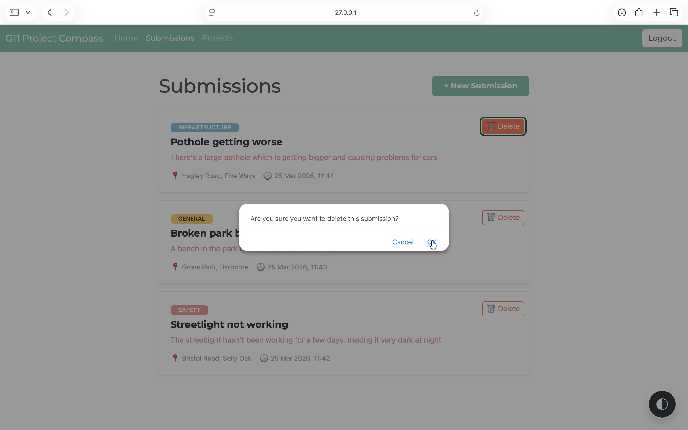 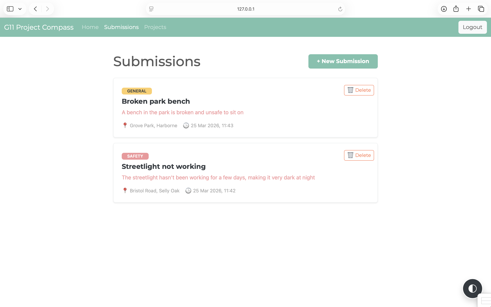 |

